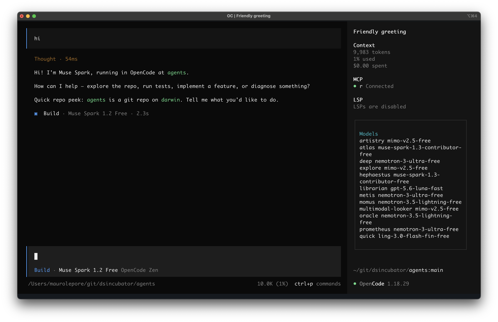
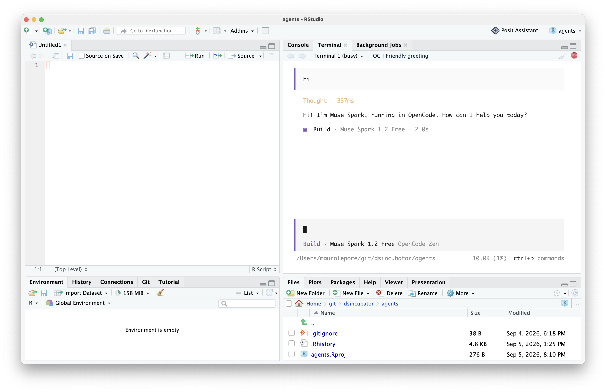
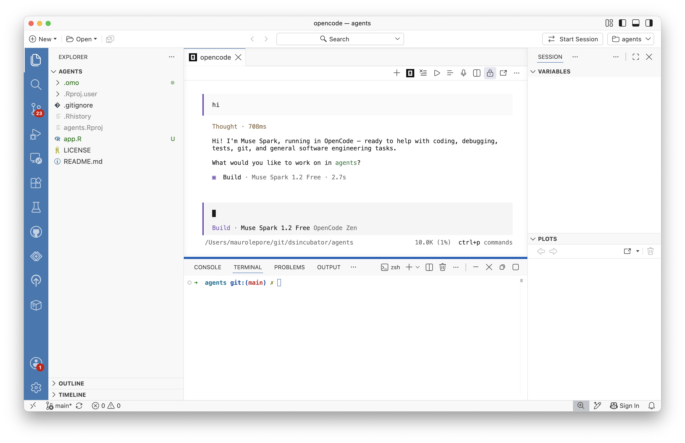

# Get started with AI agents

The goal of this meetup is to help you get started using AI agents for free.

By the end of this meetup you'll have a workflow that will take you a long way before
you feel the need to spend any money.

## Who is the audience?

Anyone who writes code by hand and wants to try an agentic AI workflow
for free, e.g., data scientists and software developers.

## Why is it important?

A lot of people are now using AI agents to write some or all of their code. One of the best AI agents today is [Claude Code](https://claude.com/product/claude-code), but using it for real work [can cost a lot](https://claude.com/pricing). This meetup shows a good and free alternative so you can practice without worrying about cost.

## Objectives

- Understand what an AI agent is.
- Install and get started with a good and free AI agent.
- Set it up to use R and Python interactively.
- Use it inside your IDE.

## Contents

### Agents and models

An [AI agent](https://en.wikipedia.org/wiki/AI_agent) is a large language model (LLM) plus additional software (harness) that allows it to act on your behalf.

$$ \text{Agent} = \text{LLM} + \text{Harness} $$

By itself, the LLM can guide you, but the one who takes action is still you.

```bash
ollama run qwen2.5:7b
```

````txt
>>> Write a new empty file.txt
To create an empty file named `file.txt` on a Unix-like system (such as Linux or macOS), you can use the following command in the terminal:

```bash
touch file.txt
```

````

With a harness, the same LLM can now act on your behalf.

```bash
opencode
```

```
## User
Write a new empty file.txt
## Assistant
**Tool: write**
## Assistant
Created an empty file named file.txt in the current directory.
```

There are many [agents](https://www.morphllm.com/best-ai-coding-agents-2026) and
[models](https://llm-stats.com/leaderboards/best-ai-for-coding). Here we'll focus on a few that are useful and free.

### Get started with OpenCode

[https://opencode.ai/](https://opencode.ai/)

> **What is OpenCode?**  
> OpenCode is an open-source agent that helps you write and run code with any AI model.
>
> **How much does OpenCode cost?**  
> OpenCode is 100% free to use. It also comes with a set of free models. There might be additional costs if you connect any other provider.

You can try `opencode` in a Docker container with:

```
docker run -it --rm ghcr.io/anomalyco/opencode
```

Or [install it](https://opencode.ai/docs) following the instructions for your OS, for example:

```
curl -fsSL https://opencode.ai/install | bash
```

Launch it:

```
opencode
```



Type `/` to see everything you can do. For example, use `/models` and `/connect` to switch to a provider like Google with an API key from [Google AI Studio](https://aistudio.google.com/api-keys).

[Learn more](https://opencode.ai/docs/tui/)

### Set up mcp-repl to use R and Python interactively

Coding agents typically run R or Python code with `Rscript -e` or `python -c`.

> [This] keeps forcing the agent to rebuild context. mcp-repl keeps the session open instead: variables, loaded packages, plots, and other state stay available until you or the model reset.  
> -- [https://github.com/posit-dev/mcp-repl](https://github.com/posit-dev/mcp-repl)

Now you can ask an AI agent to "read https://github.com/posit-dev/mcp-repl and set up mcp-repl for opencode."

These examples show the behavior with and without that tool:

- With mcp-repl enabled

````text
## User
Write a new empty file.txt

## Assistant
**Tool: write**

## Assistant
Created an empty file named file.txt in the current directory.
````

- With mcp-repl disabled

````text
## User
Run x <- 1 in R

## Assistant
Running `x <- 1` in R.
**Tool: bash**

## Assistant
Executed `x <- 1` in R via `Rscript`:
```
[1] 1
```
`x` assigned value `1` successfully.

## User
Now run exists("x")

## Assistant
Running `exists("x")` — noting Rscript sessions are isolated, so chaining with previous assignment.
**Tool: bash**

## Assistant
`Rscript -e 'print(exists("x"))'` returns:
```
[1] FALSE
```
Each `Rscript -e` invocation is an isolated process, so `x <- 1` from the previous call does not persist.
In the same session:
```
Rscript -e 'x <- 1; print(exists("x"))'
[1] TRUE
```
````

### OpenCode in an IDE: RStudio and Positron

OpenCode, like most AI agents, can run in any terminal, including inside IDEs like RStudio or Positron.





Now go ahead, build something useful and have fun!

## Resources

- [What is an agent?](https://tidydesign.substack.com/p/what-is-an-agent)
- [OpenCode](https://opencode.ai)
- [Ollama](https://docs.ollama.com/quickstart)


